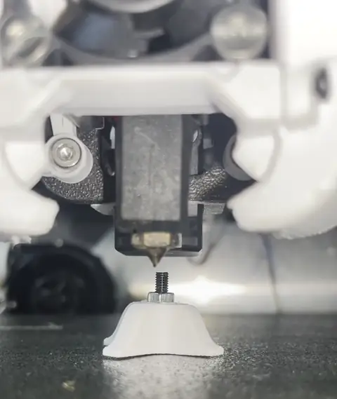

# EddySeek

**Nozzle alignment for Klipper toolchangers using an LDC1612 eddy-current sensor.**

EddySeek reads an LDC1612 coil, exposes live frequency data to Moonraker,
runs XY search routines, and measures per-tool XY offsets relative to a reference nozzle.

## Demo



Full quality: [`docs/media/demo_centroid.mp4`](docs/media/demo_centroid.mp4)

> **Note:** The video shows a stationary screw with a sensor being aligned over it for demonstration.
> On the printer, the **nozzle** moves and the **sensor stays fixed** on the bed or frame.

## Quick start

```bash
cd ~
git clone https://github.com/charliemayall/EddySeek.git
cd EddySeek
./install.sh
```

Add to `moonraker.conf` for update-manager support:

```ini
[update_manager eddy_seek]
type: git_repo
path: ~/EddySeek
origin: https://github.com/charliemayall/EddySeek.git
primary_branch: main
managed_services: klipper
is_system_service: False
```

Add `[eddy_seek]` to `printer.cfg`, restart Klipper, then:

```gcode
EDDY_SEEK_QUERY
EDDY_SEEK_START
```

For toolchanger workflows, see the full guide.

## Documentation

**[User Guide](docs/USER_GUIDE.md)** - install, configuration, G-code reference,
toolchanger alignment workflow, strategies, Moonraker fields, and troubleshooting.

## Requirements

- Klipper / Kalico
- LDC1612 eddy-current sensor (dedicated probe for nozzle alignment)
- Tool-load G-code macros for each tool (e.g. `T0`, `T1`, …)

## Development

```bash
uv sync --group dev
uv run ruff check .
uv run pytest
```

> Any overview of the states and processes covered by this codebase may be of use, see [Calibration Process](docs/CALIBRATION_PROCESS.md).

## License

[GNU GPLv3](LICENSE)
