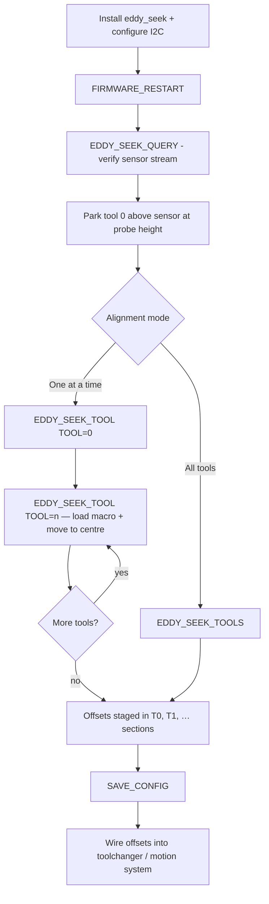
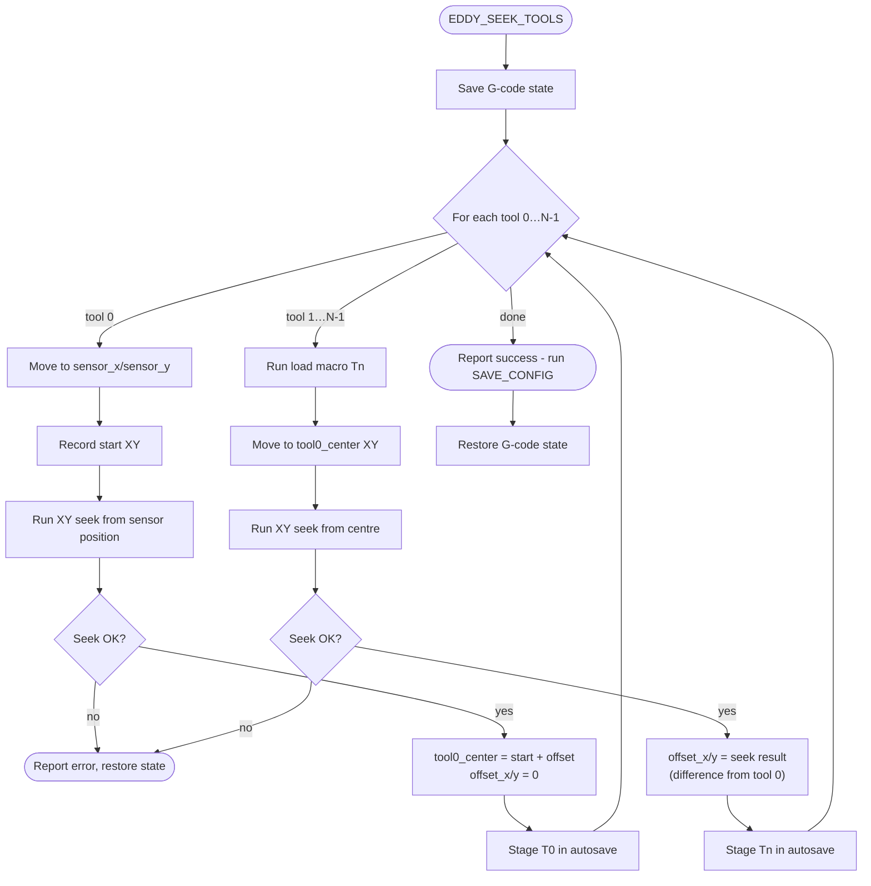
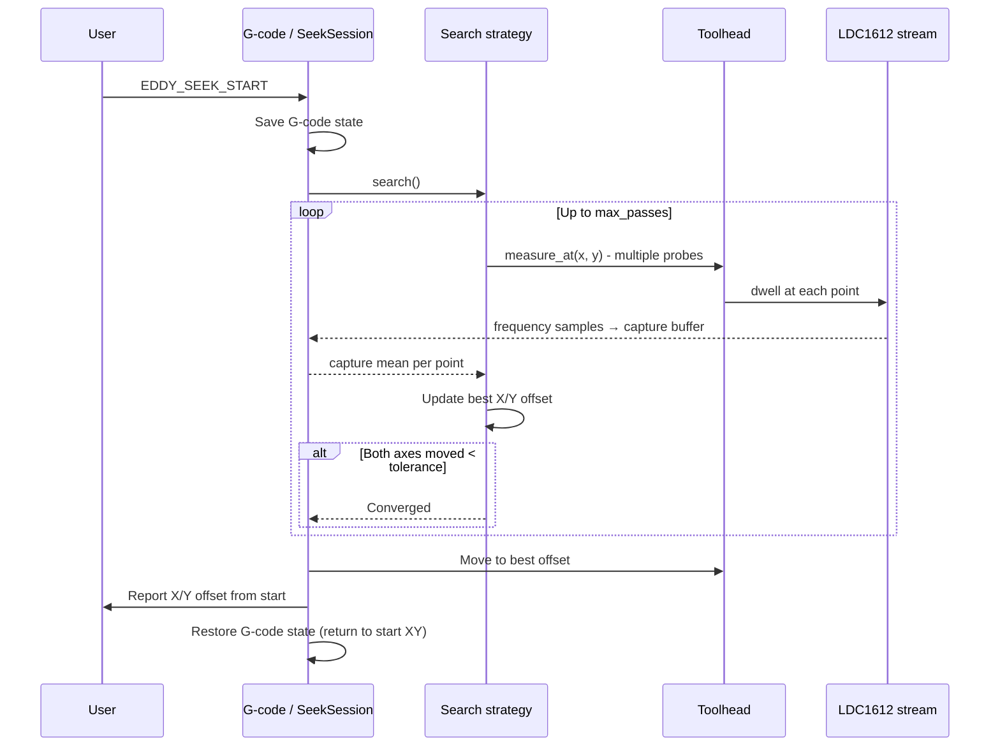
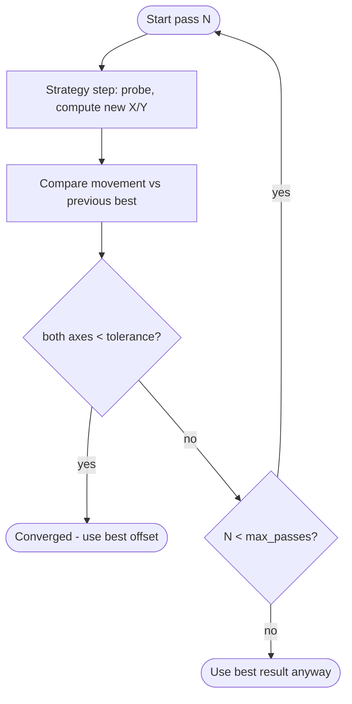
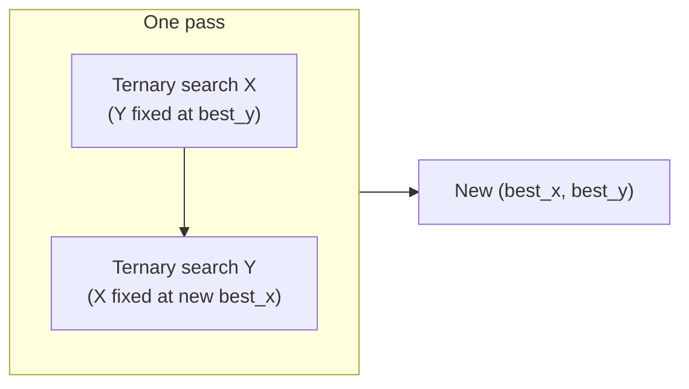
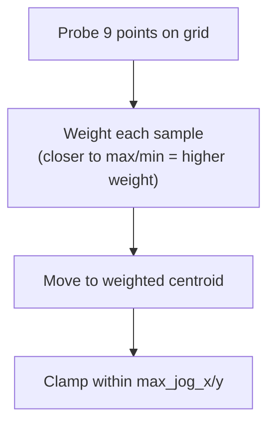
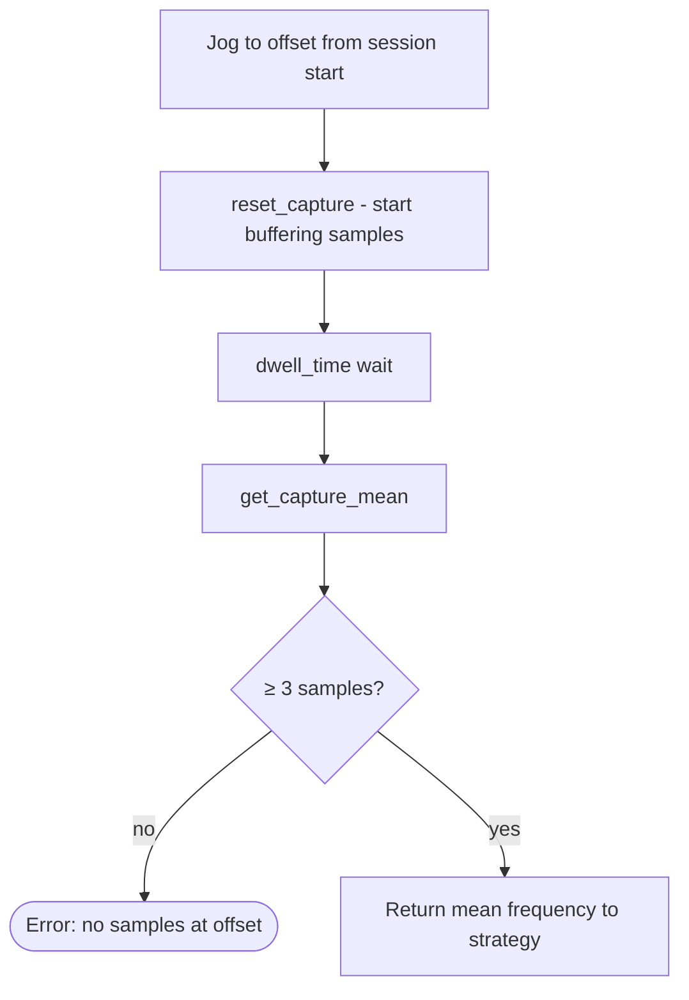

# EddySeek Calibration Process

This document describes how EddySeek calibrates nozzle XY positions using the
LDC1612 eddy-current sensor. It covers the user-facing workflow, the multi-tool
sequence, and the internal XY search loop.

For install, configuration, and G-code reference, see the [User Guide](USER_GUIDE.md).

---

## Overview

Calibration finds where each nozzle sits relative to a **reference point** on the
sensor coil. The coil frequency changes as the nozzle moves in XY; EddySeek jogs
the toolhead, samples frequency at each point, and converges on the peak (or
valley) that marks the sensor centre.

| Mode                 | Command                 | Result                                               |
| -------------------- | ----------------------- | ---------------------------------------------------- |
| Single-position seek | `EDDY_SEEK_START`       | Offset from current XY to sensor centre              |
| One tool             | `EDDY_SEEK_TOOL TOOL=n` | Per-tool offset staged in config autosave            |
| All tools            | `EDDY_SEEK_TOOLS`       | Tool 0 defines centre; tools 1…N measured against it |

After any tool alignment command succeeds, run `SAVE_CONFIG` to write offsets to
`printer.cfg`.

---

## End-to-end toolchanger workflow



**Tool 0** is special: it establishes the absolute sensor-centre XY in machine
coordinates. **Subsequent tools** are loaded, moved to that centre, then seeked;
the resulting offset is the XY difference from tool 0.

---

## Multi-tool alignment sequence

`EDDY_SEEK_TOOLS` (and repeated `EDDY_SEEK_TOOL` calls) follow this logic:



---

## XY seek session (`EDDY_SEEK_START`)

Every alignment measurement runs through `SeekSession`. The toolhead starts at
the user's parked position; the session jogs within `max_jog_x` / `max_jog_y`,
reports the final offset, then **returns to the starting XY**.



---

## Search pass loop

Each pass refines the best-known nozzle offset. The configured **strategy**
decides how probe points are chosen within the jog radius.



### Ternary strategy (`strategy: ternary`)

Each pass runs a 1-D ternary search on **X**, then **Y**, within the jog radius.
Up to `max_iter` subdivisions per axis.



At each ternary subdivision, two probe points divide the interval; the side with
the better frequency (per `search_for: max|min`) is kept.

### Centroid strategy (`strategy: centroid`)

Each pass probes a **3×3 grid** around the current best point. Grid spacing
halves every pass (`grid_step × 0.5^(pass−1)`). Sampled frequencies are
weighted toward the target extreme and the toolhead moves to the weighted
centroid.



---

## Single probe cycle (`measure_at`)

Every probe point - whether from ternary or centroid - follows the same
measurement steps:



The LDC1612 driver pushes frequency batches continuously; `reset_capture` marks
the window used for that probe point.

---

## What gets saved

After alignment, staged config sections look like:

```ini
[T0]
offset_x: 0.000000
offset_y: 0.000000
is_calibrated: True

[T1]
offset_x: 1.234000
offset_y: -0.456000
is_calibrated: True
```

| Tool  | `offset_x` / `offset_y` meaning                             |
| ----- | ----------------------------------------------------------- |
| T0    | Always `0, 0` - defines the reference centre                |
| T1…Tn | XY shift needed so this nozzle matches tool 0 on the sensor |

`SAVE_CONFIG` persists these values. Your toolchanger macros or motion system
apply them when switching tools.

---

## Related commands

| Command              | Role in calibration                                       |
| -------------------- | --------------------------------------------------------- |
| `EDDY_SEEK_QUERY`    | Confirm live sensor data before calibrating               |
| `EDDY_SEEK_RESET`    | Clear capture buffer                                      |
| `EDDY_SEEK_SET`      | Tune tolerance, strategy, dwell, etc. without editing cfg |
| `EDDY_SEEK_ACCURACY` | Repeat `EDDY_SEEK_START` and report repeatability stats   |
