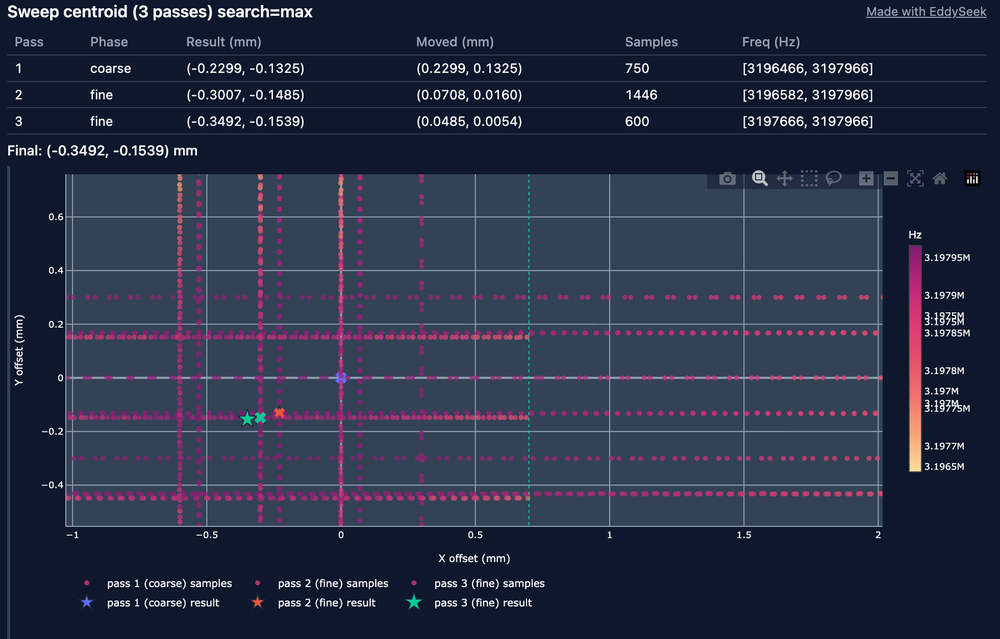
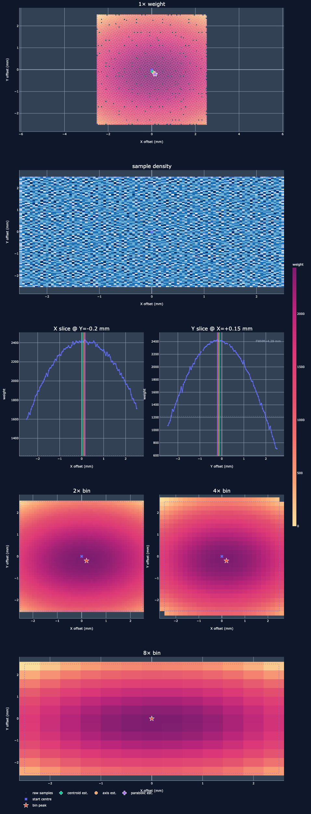

# EddySeek User Guide

EddySeek is a Klipper extra for **nozzle alignment on toolchanger printers** using an
LDC1612 eddy-current sensor. It reads live coil frequency, runs XY search routines,
and can measure per-tool offsets relative to a reference nozzle.

---

## What you need

- Klipper or Kalico
- An LDC1612 eddy-current probe (dedicated to nozzle alignment - not your bed-mesh probe)
- A toolchanger or multi-nozzle setup where each tool can be parked above the sensor
- A G-code macro (or command) that loads each tool, e.g. `T0`, `T1`, …

---

## Install

```bash
cd ~
git clone https://github.com/charliemayall/EddySeek.git
cd EddySeek
./install.sh
```

You can specify Klipper's extras path if it is not the default.

```bash
./install.sh ~/my_non_standard_dir/klipper/klippy/extras
```

**Moonraker update-manager** - add to `moonraker.conf`, run `./install.sh` once,
then updates pull the repo, re-run install, and restart Klipper:

```ini
[update_manager eddy_seek]
type: git_repo
path: ~/EddySeek
origin: https://github.com/charliemayall/EddySeek.git
primary_branch: main
channel: stable
managed_services: klipper
is_system_service: False
post_update_script: install.sh
```

Add configuration to `printer.cfg` (see below), then restart Klipper with `FIRMWARE_RESTART`.

---

## Hardware and sensor setup

The LDC1612 is configured **inside** `[eddy_seek]`. Use a dedicated probe for
nozzle alignment - not your bed-mesh probe.

| Option        | Description                               |
| ------------- | ----------------------------------------- |
| `sensor_type` | Must be `ldc1612`                         |
| `i2c_address` | I2C address (default `42` / `0x2a`)       |
| `i2c_mcu`     | MCU the sensor is wired to, e.g. `mcu`    |
| `i2c_bus`     | Hardware I2C bus on that MCU, e.g. `i2c1` |

Example:

```ini
[eddy_seek]
sensor_type: ldc1612
i2c_address: 42
i2c_mcu: mcu
i2c_bus: i2c1
sensor_x: 150.0   # machine XY of coil - rough is fine
sensor_y: 150.0
```

Optional LDC1612 tuning keys (same as Klipper's `[ldc1612]` section) can also
live in `[eddy_seek]`, e.g. `frequency`, `max_sensor_hz`, `reg_drive_current`.

## Minimal calibration workflow

1. Install and add `[eddy_seek]` to `printer.cfg` - include I2C settings and `sensor_x` / `sensor_y` (rough coordinates are fine; the seek refines within `max_jog`).
2. `FIRMWARE_RESTART`
3. `EDDY_SEEK_QUERY` - confirm samples increment.
4. Load tool 0 and park it at probe height above the sensor (EddySeek does not move Z).
5. `EDDY_SEEK_TOOLS` (or `EDDY_SEEK_TOOL TOOL=0`, then repeat for each tool).
6. `SAVE_CONFIG`
7. `EDDY_SEEK_APPLY_OFFSET TOOL=n` - apply the offset in toolchanger macros or your slicer.

After a Klipper restart, run tool 0 again before `EDDY_SEEK_TOOL TOOL=n` for other tools - or use `EDDY_SEEK_TOOLS`, which runs tool 0 first.

---

## Configuration reference

### `[eddy_seek]` section

| Option                   | Default                                   | Description                                                                                                          |
| ------------------------ | ----------------------------------------- | -------------------------------------------------------------------------------------------------------------------- |
| `sensor_type`            | _(required)_                              | `ldc1612`                                                                                                            |
| `i2c_address`            | `42`                                      | LDC1612 I2C address (`0x2a`)                                                                                         |
| `i2c_mcu`                | _(required)_                              | MCU name, e.g. `mcu`                                                                                                 |
| `i2c_bus`                | _(required)_                              | I2C bus on that MCU, e.g. `i2c1`                                                                                     |
| `tool_count`             | `1`                                       | Number of tools on the changer                                                                                       |
| `tool_prefix`            | `T`                                       | Prefix for saved offset sections (`T0`, `T1`, …)                                                                     |
| `load_tool_macro_prefix` | `T`                                       | Prefix for the G-code that loads a tool (`T` → macro `T0`, `T1`, …)                                                  |
| `sensor_x`               | _(required)_                              | Machine X of the sensor coil; tool 0 moves here before seeking                                                       |
| `sensor_y`               | _(required)_                              | Machine Y of the sensor coil; tool 0 moves here before seeking                                                       |
| `max_jog_x`              | `2.5`                                     | Max X search radius from start (mm)                                                                                  |
| `max_jog_y`              | `2.5`                                     | Max Y search radius from start (mm)                                                                                  |
| `tolerance`              | `0.1`                                     | Stop a pass when X and Y movement are both below this (mm)                                                           |
| `dwell_time`             | `0.5`                                     | Seconds to wait at each probe point for samples                                                                      |
| `jog_speed`              | `10`                                      | Feedrate for search jogs (mm/s)                                                                                      |
| `search_for`             | `max`                                     | `max` or `min` - which frequency extreme marks the nozzle centre                                                     |
| `strategy`               | `sweep_centroid`                          | `sweep_centroid` (default), `ternary`, `centroid`, or `debug_scan` (diagnostic only)                                 |
| `grid_step_x`            | `max_jog_x / 2`                           | Centroid grid spacing in X (mm)                                                                                      |
| `grid_step_y`            | `max_jog_y / 2`                           | Centroid grid spacing in Y (mm)                                                                                      |
| `max_iter`               | `10`                                      | Ternary iterations per axis per pass                                                                                 |
| `max_passes`             | `6`                                       | Alternating X/Y search passes before giving up                                                                       |
| `save_session_trace`     | `False`                                   | Write probe data to `/tmp/seek_trace.json` after each seek (debug)                                                   |
| `save_plots`             | `False`                                   | Write HTML debug plots to `result_folder` (requires plotly extra)                                                    |
| `result_folder`          | `~/printer_data/config/eddy_seek_results` | Output directory for debug plots                                                                                     |
| `sweep_coarse_speed`     | `20`                                      | Sweep coarse pass feedrate (mm/s); sweep_centroid only                                                               |
| `sweep_fine_speed`       | `10`                                      | Sweep fine pass feedrate (mm/s)                                                                                      |
| `sweep_overscan`         | `1.0`                                     | Extra travel beyond jog range (mm)                                                                                   |
| `sweep_cross_offset`     | `0.3`                                     | Perpendicular stagger between parallel sweeps (mm)                                                                   |
| `sweep_cross_passes`     | `3`                                       | Staggered sweep lines per axis; 3 helps on asymmetric coil response                                                  |
| `fine_shrink`            | `0.4`                                     | Fine pass range multiplier (× max_jog)                                                                               |
| `min_sweep_samples`      | `20`                                      | Minimum profile points before centroid fit                                                                           |
| `debug`                  | `False`                                   | Verbose console output (config dumps, per-repeat tables); registers `ES_DEBUG_CONSOLE`; pass `VERBOSE=1` on any command for one-off verbosity |

> **Speed units:** `jog_speed`, `sweep_coarse_speed`, and `sweep_fine_speed` are in **mm/s** in `printer.cfg` and `EDDY_SEEK_SET`.

> **Note:** `sensor_x +/- max_jog_x` and `sensor_y +/- max_jog_y` should be within the machine's travel limits.

Example for a four-tool changer:

```ini
[eddy_seek]
sensor_type: ldc1612
i2c_address: 42
i2c_mcu: mcu
i2c_bus: i2c1

tool_count: 4
tool_prefix: es_T
load_tool_macro_prefix: T

sensor_x: 20.0
sensor_y: 20.0
# max_jog defaults to 2.5 mm; widen if tool 0 is >2.5 mm off sensor_x/y
tolerance: 0.1
dwell_time: 0.5
jog_speed: 10
search_for: max
strategy: sweep_centroid
max_iter: 10
max_passes: 6
save_session_trace: True
```

### Per-tool offset sections

After alignment, offsets are staged in the config autosave under sections named
`{tool_prefix}{n}` (default `es_T1`, `es_T2`, …). Tool numbers are **0-based**.

```ini
[es_T1]
offset_x: 0.000000 ; ❌
offset_y: 0.000000 ; ❌
manual_adjust_x: 0.000000 ; ✅ You can edit this line
manual_adjust_y: 0.000000 ; ✅ You can edit this line
is_calibrated: True ; ❌
```

Run `SAVE_CONFIG` in the console to persist staged values to `printer.cfg`.

You can manually adjust the offset by adding to the `manual_adjust_x` and `manual_adjust_y` fields. This will **add / subtract** to the calibrated offset, not replace it.

---

## Verify the sensor stream

Run in the G-code console:

```
EDDY_SEEK_QUERY
```

Expected output (values will vary):

```
Sensor 12.3 MHz (capture: 12.1 MHz, 42 samples, sample_rate: 400 Hz)
```

With `VERBOSE=1` or `debug: True`, `EDDY_SEEK_SET` without parameters also prints the full config on one line (logged to `klippy.log` either way).

If `total` stays at `0`, check the following:

- `eddy_seek.py` and `_eddy_seek/` are installed (or symlinked)
- `sensor_type`, `i2c_mcu`, and `i2c_bus` are set correctly in `[eddy_seek]`
- The probe is wired and the driver initialised
- Check `klippy.log` for `eddy_seek: initialised` and subscription messages

---

## Alignment workflow

### Single-nozzle XY seek (`EDDY_SEEK_START`)

Use this to find the sensor centre at the current XY position - for debugging,
repeatability checks, or manual offset measurement.

Example output:

```
ES: Seeking nozzle centre (sweep_centroid)…
Pass 1: X=+0.12 Y=-0.06 mm
Pass 2: X=+0.04 Y=-0.02 mm
ES: Done - offset X=+0.1200 Y=-0.0600 mm (2 passes)
```

### Toolchanger alignment (`EDDY_SEEK_TOOL` / `EDDY_SEEK_TOOLS`)

**Tool 0** establishes the reference centre on the sensor. **Subsequent tools** are moved to that centre, then seeked. The resulting offset is the XY difference Tool n --> Tool 0.

> **Tool 0 must be aligned before other tools.**

> **Auto-positioning:** set `sensor_x`/`sensor_y` to the sensor coil's
> machine XY position. Tool 0 jogs there automatically before seeking.
> The seek refines within `max_jog`, so the coordinates only need to be within a few mm of the true centre.
> **Z is not changed** - park at probe height before running the alignment commands.

#### One tool at a time (`EDDY_SEEK_TOOL TOOL=n`)

- Load tool 0, then `EDDY_SEEK_TOOL TOOL=0`
- Load tool 1, then `EDDY_SEEK_TOOL TOOL=1` (repeat for each tool)

`EDDY_SEEK_TOOL` does not run load macros - load each tool yourself before calling it.

Run `SAVE_CONFIG` to persist offsets for each tool you calibrated.

#### All tools (`EDDY_SEEK_TOOLS`)

```
; Load Tool 0, then run
EDDY_SEEK_TOOLS

SAVE_CONFIG
```

For tools 1 --> N, EddySeek runs `{load_tool_macro_prefix}{n}` (default `T1`, `T2`, …)
before aligning. XY gcode offset is cleared before each seek (including after load
macros) and restored when alignment finishes.

Tool 0 must already be loaded before you run this command.

Example `EDDY_SEEK_TOOLS` output (two tools, two passes each):

```
ES: Aligning tool 1 of 2…
Pass 1: X=+0.10 Y=-0.05 mm
Pass 2: X=+0.04 Y=-0.02 mm
Tool 0 reference - X=+150.0400 Y=+149.9800 mm
Aligning tool 2 of 2…
Pass 1: X=+0.08 Y=-0.03 mm
Tool 1 offset - X=+1.2340 Y=-0.4560 mm
ES: 2 tools aligned - run SAVE_CONFIG to persist
```

---

## G-code commands

| Command                         | Description                                             |
| ------------------------------- | ------------------------------------------------------- |
| `EDDY_SEEK_QUERY`               | Print current frequency statistics                      |
| `EDDY_SEEK_RESET`               | Clear capture buffer before a measurement               |
| `EDDY_SEEK_SET`                 | Override seek settings until restart (see below)        |
| `EDDY_SEEK_START`               | Run XY search from current position                     |
| `EDDY_SEEK_ACCURACY`            | Repeat alignment and report repeatability               |
| `EDDY_SEEK_TOOL TOOL=n`         | Align one tool (0-based); caller loads the tool first   |
| `EDDY_SEEK_TOOLS`               | Align all tools; runs load macros for tools 1…N         |
| `EDDY_SEEK_TOOLS TOOLS=n`       | Align tools 0…n−1 only (optional; default is all tools) |
| `EDDY_SEEK_APPLY_OFFSET TOOL=n` | Apply saved XY offset for a tool via SET_GCODE_OFFSET   |

### `EDDY_SEEK_SET`

Temporarily change search parameters without editing `printer.cfg`. Parameters
match the `[eddy_seek]` config keys:

Example:

```
EDDY_SEEK_SET STRATEGY=centroid
EDDY_SEEK_SET STRATEGY=debug_scan
EDDY_SEEK_SET TOLERANCE=0.05 MAX_PASSES=8
```

Run `EDDY_SEEK_SET` without parameters to print current values.

Overrides last until Firmware Restart.

### `EDDY_SEEK_ACCURACY`

```
EDDY_SEEK_ACCURACY REPEATS=5
```

Runs full `EDDY_SEEK_START` alignment `REPEATS` times (default 3, min 2, max 50),
returns to the start XY between runs, then prints a two-line repeatability summary.
Compare σ and max scatter across repeats when changing `dwell_time`, `tolerance`, or `strategy`.

Example output:

```
ES: Running 5 seek repeat(s) from current position
Repeat 1/5
Pass 1: X=+0.12 Y=-0.06 mm
…
Repeat 1 - X=+0.1200 Y=-0.0600 mm
Repeat 2/5
…
Repeatability (5 runs): mean X=+0.0100 Y=-0.0200 mm, σ X=0.003 Y=0.004 mm
Max scatter 0.012 mm - max pairwise 0.018 mm
ES: Accuracy test complete (5 repeats)
```

Per-repeat offset lines and the full stats table are available with `VERBOSE=1` or `debug: True`.

---

## Search strategies

### Sweep centroid (`strategy: sweep_centroid`)

Continuous axis sweeps (similar to bed mesh
`METHOD=rapid_scan`). Starts with coarse bidirectional sweeps over the full
jog range, followed by finer sweeps. Samples from both axes are merged and
a frequency-weighted 2D centroid is computed, weighting samples by how
close each frequency is to the target extreme (`search_for`).

Continuous motion means this strategy is faster than the others (expect 2-4x faster).

Parallel sweeps at staggered cross-axis offsets improve sampling density.
`dwell_time` is ignored when using sweep_centroid.

Set `search_for` to `max` if the nozzle centre gives the **highest** frequency, or
`min` if it gives the **lowest** (depends on coil geometry and target material).

Can be impacted by machine motion abilities, but usually performs the best.

Seeks for Tool 1+ may finish very early, this is normal and expected.

### Centroid (`strategy: centroid`)

Similar to `sweep_centroid`, but uses a 3×3 grid around the current best point, and dwells at each point for `dwell_time` seconds.

Useful if your sensor sample rate is too low to get a good centroid with `sweep_centroid`.

### Ternary (`strategy: ternary`)

Each pass runs a 1-D ternary search on X, then Y, within `max_jog_x` / `max_jog_y`.
Use when the frequency peak is smooth and single-valued; try `sweep_centroid` first.

### Debug scan (`strategy: debug_scan`)

[See below](#troubleshooting) for more information.

Do not use this strategy for alignment.

---

## Debug plots and session traces

> Requires plotly on the Klipper host (Moonraker venv example):

> ```bash
>  ~/klippy-env/bin/pip3 install plotly
> ```

When `save_plots: True`, each seek run writes HTML plots under a per-run folder
in `result_folder` (default `~/printer_data/config/eddy_seek_results`):

```
{result*folder}/HH_MM_DD_MM_YY*{run_id}/{label}.html
```

Multi-tool and accuracy runs share one folder. Session trace JSON files use the
same layout when `save_session_trace: True`.

Open in a browser to inspect probe positions, frequency
samples, and per-pass results. (Not in the mainsail / fluidd web interface)

**You must download the html file and open it in a browser to view it. (Mainsail will just display the source code)**

---

## Moonraker / host API

The `eddy_seek` printer object is available via `printer.objects.query` and
`printer.objects.subscribe`.

| Field           | Description                                                                                                                               |
| --------------- | ----------------------------------------------------------------------------------------------------------------------------------------- |
| `last_freq`     | Most recent sample (Hz)                                                                                                                   |
| `smooth_mean`   | Rolling mean of the last 20 samples (Hz)                                                                                                  |
| `capture_mean`  | Mean since last `EDDY_SEEK_RESET` (Hz)                                                                                                    |
| `capture_count` | Samples in current capture session                                                                                                        |
| `total_samples` | Total samples since Klipper started                                                                                                       |
| `sample_rate_hz`  | Bulk sample rate (Hz) from the last `EDDY_SEEK_QUERY`; `null` until queried                                                             |
| `tools`         | Map of `T{n}` → `offset_x`, `offset_y`, `manual_adjust_x`, `manual_adjust_y`, `effective_offset_x`, `effective_offset_y`, `is_calibrated` |

---

## Troubleshooting

| Symptom                                     | Things to check                                                                                                                                                                                                                                                                                                           |
| ------------------------------------------- | ------------------------------------------------------------------------------------------------------------------------------------------------------------------------------------------------------------------------------------------------------------------------------------------------------------------------- |
| `total` stays 0 on `EDDY_SEEK_QUERY`        | I2C wiring, `i2c_mcu` / `i2c_bus`, `klippy.log` init errors                                                                                                                                                                                                                                                               |
| `no samples at offset` during seek          | Increase `dwell_time`; verify sensor stream; check coil height                                                                                                                                                                                                                                                            |
| Search does not converge                    | Increase `max_passes` or decrease/increase `max_jog_x/y`; try `centroid` or `sweep_centroid`; check `search_for`                                                                                                                                                                                                          |
| `pass corrections diverging`                | Typically means the nozzle is not being located correctly, usually because the start point places it too far from the sensor center. Check that `sensor_x` and `sensor_y` put the nozzle as close to the sensor center as possible. Increase `max_jog_x/y` if necessary. Check the height of the nozzle above the sensor. |
| Sweep centroid: too few samples             | Lower `sweep_fine_speed`; check LDC1612 stream. Short fine passes may auto-reduce sweep feedrate to satisfy `min_sweep_samples` at ~400 Hz.                                                                                                                                                                               |
| `tool 0 must be aligned before other tools` | Run `EDDY_SEEK_TOOL TOOL=0` or start `EDDY_SEEK_TOOLS` from tool 0                                                                                                                                                                                                                                                        |
| Tool load fails                             | `load_tool_macro_prefix` must match your macros (`T0`, `LOAD_TOOL_0`, etc.)                                                                                                                                                                                                                                               |
| Offsets not in `printer.cfg`                | Run `SAVE_CONFIG` after alignment commands succeed                                                                                                                                                                                                                                                                        |

### Debug scan (`strategy: debug_scan`)

**⚠️This is a diagnostic strategy and should not be used for alignment.**

```gcode
EDDY_SEEK_SET SAVE_PLOTS=True ; you will need to install plotly if you haven't already
EDDY_SEEK_SET STRATEGY=debug_scan

; run at current position
EDDY_SEEK_START

; Or run using sensor_x and sensor_y coordinates
EDDY_SEEK_TOOL TOOL=0
```

Runs a diagnostic grid sweep over the full area available to EddySeek.

Set `save_plots: True` before running.

You can use this to check that your sensor is detecting something within the area made available by your config.

---

## Example plots

### Sweep centroid example



### Debug scan example



## License

EddySeek is licensed under the [GNU General Public License v3.0](../LICENSE).
